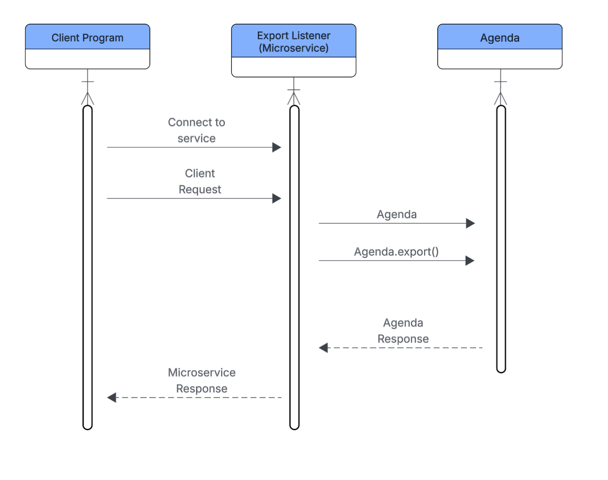

# Task Export Microservice
Sending requests to the microservice:

Step 1: Download and run this microservice. 
        Install needed requirements using 
```commandline
pip install -r requirements.txt
```

Step 2: Run export_listener.py to start listening. Connect to server tcp://localhost:5050, port number can be adjusted in the python file.

Step 3: Send a JSON formatted request like the one below. Optional fields can be omitted and be replaced with default values. Required fields will error if not provided

```python
{
    # Required fields 
   "export_type": "txt", # Can be txt, csv, ics
   "export_folder_path": "EXPORT", # Can be relative or absolute path to folder. Will be created if it doesn't exist.
   "events": [
       # Each event is a dictionary with a name and date.
       # Date is a string in the format YYYY-MM-DD.
       {
           "name": "deep clean fridge",
           "date": "2025-01-01"
       },
       {
           "name": "deep clean fridge2",
           "date": "2025-03-01"
       }
   ],
    # Optional fields below.
   "timezone": "US/Pacific", # Optional field relevant for ics. Valid timezones are listed here https://gist.github.com/heyalexej/8bf688fd67d7199be4a1682b3eec7568
}
```

Response Format:

```python
{
    "status" : bool, #True on success, False on failure
    "file_path" : str|None, # file path string of exported file, or None if failed
    "response" : str   #logging from server
}

```

UML sequence diagram:
